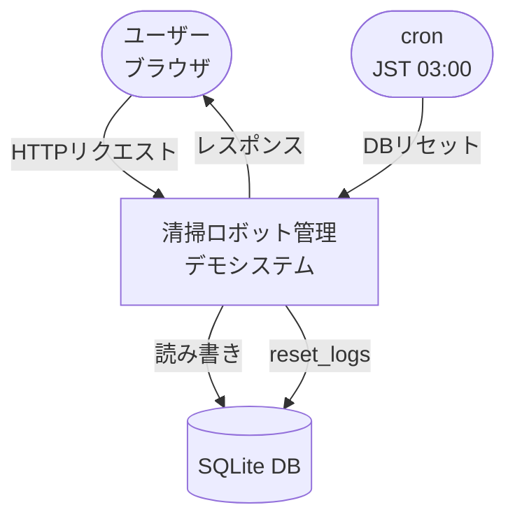
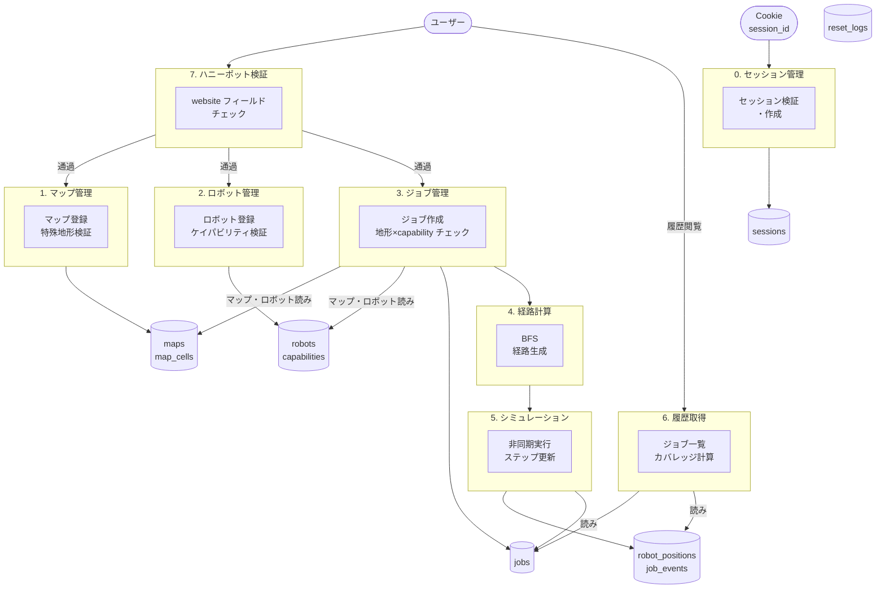

# データフロー図（DFD）

最終更新: 2026-06-06

## Level 0 — コンテキスト図

```mermaid
flowchart TD
    User([ユーザー\nブラウザ])
    Cron([cron\nJST 03:00])
    System[清掃ロボット管理\nデモシステム]
    DB[(SQLite DB)]

    User -- HTTPリクエスト --> System
    System -- レスポンス --> User
    System -- 読み書き --> DB
    Cron -- DBリセット --> System
    System -- reset_logs --> DB
```

## Level 1 — 詳細フロー

```mermaid
flowchart TD
    User([ユーザー])
    Cookie([Cookie\nsession_id])

    subgraph P0[0. セッション管理]
        S0[セッション検証\n・作成]
    end

    subgraph P7[7. ハニーポット検証]
        S7[website フィールド\nチェック]
    end

    subgraph P1[1. マップ管理]
        S1[マップ登録\n特殊地形検証]
    end

    subgraph P2[2. ロボット管理]
        S2[ロボット登録\nケイパビリティ検証]
    end

    subgraph P3[3. ジョブ管理]
        S3[ジョブ作成\n地形×capability チェック]
    end

    subgraph P4[4. 経路計算]
        S4[BFS\n経路生成]
    end

    subgraph P5[5. シミュレーション]
        S5[非同期実行\nステップ更新]
    end

    subgraph P6[6. 履歴取得]
        S6[ジョブ一覧\nカバレッジ計算]
    end

    DB_maps[(maps\nmap_cells)]
    DB_robots[(robots\ncapabilities)]
    DB_jobs[(jobs)]
    DB_pos[(robot_positions\njob_events)]
    DB_sess[(sessions)]
    DB_reset[(reset_logs)]

    Cookie --> P0
    P0 --> DB_sess
    User --> P7
    P7 -->|通過| P1
    P7 -->|通過| P2
    P7 -->|通過| P3
    P1 --> DB_maps
    P2 --> DB_robots
    P3 -->|マップ・ロボット読み| DB_maps
    P3 -->|マップ・ロボット読み| DB_robots
    P3 --> DB_jobs
    P3 --> P4
    P4 --> P5
    P5 --> DB_pos
    P5 --> DB_jobs
    User -->|履歴閲覧| P6
    P6 -->|読み| DB_jobs
    P6 -->|読み| DB_pos
```
