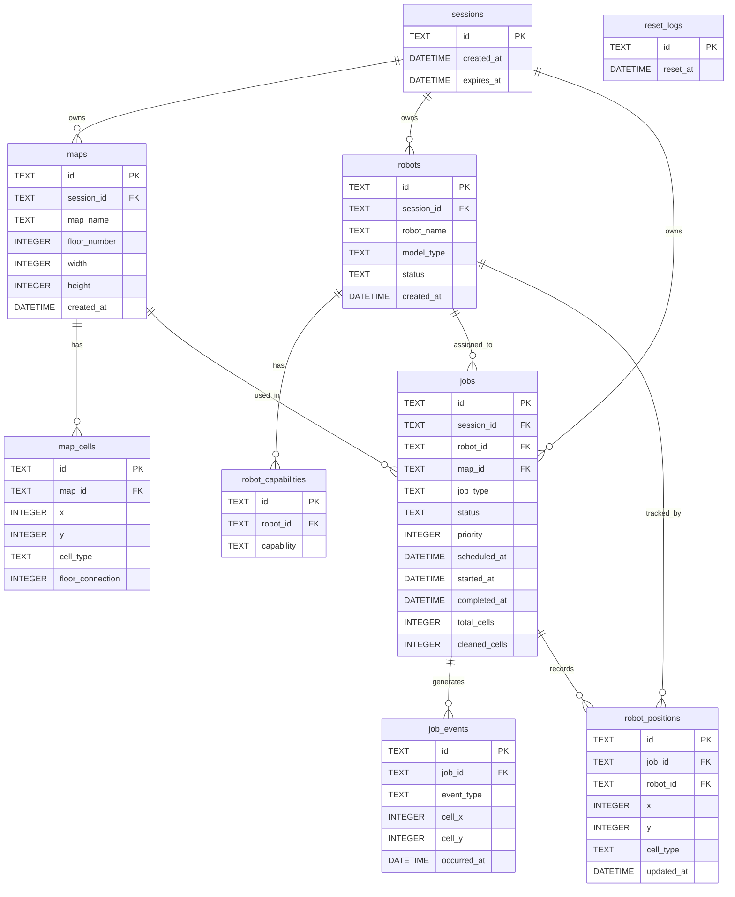

# ER 図

最終更新: 2026-06-06

## マスタ値

### cell_type

| 値 | 説明 |
|----|------|
| FLOOR | 通常の床 |
| WALL | 壁（移動不可） |
| NARROW_GAP | 狭い隙間（NARROW_GAP_TRAVERSE が必要） |
| STAIR_UP | 階段（上り）（STAIR_TRAVERSE + floor_connection 必須） |
| STAIR_DOWN | 階段（下り）（STAIR_TRAVERSE + floor_connection 必須） |
| CHARGING_STATION | 充電ステーション（BFS 出発点） |

### model_type

| 値 | 説明 |
|----|------|
| STANDARD | 標準モデル |
| SLIM | スリムモデル |
| STAIR_CAPABLE | 階段対応モデル |

### capability

| 値 | 説明 |
|----|------|
| BASIC_CLEAN | 基本清掃（FULL_CLEAN に必須） |
| EDGE_CLEAN | エッジ清掃（EDGE_CLEAN に必須） |
| NARROW_GAP_TRAVERSE | 狭所通過（NARROW_ONLY に必須） |
| STAIR_TRAVERSE | 階段通過（STAIR_CLEAN に必須） |
| SPOT_CLEAN | スポット清掃（SPOT_CLEAN に必須） |
