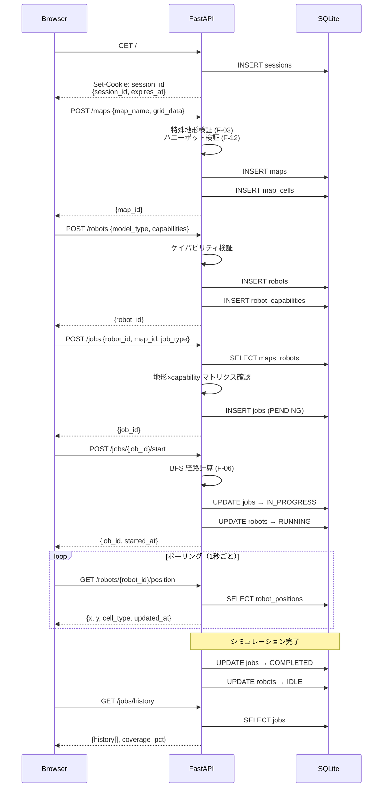
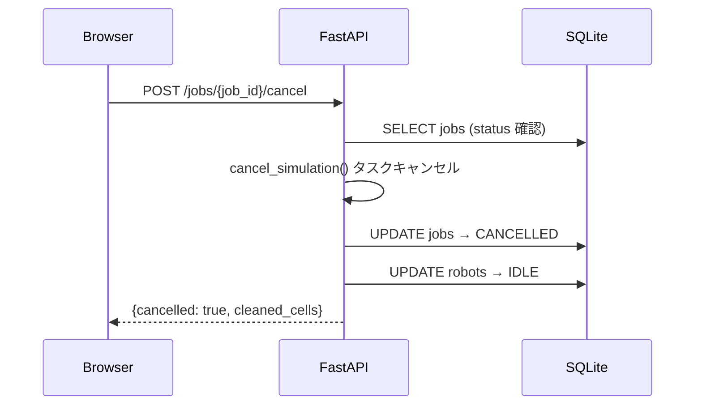
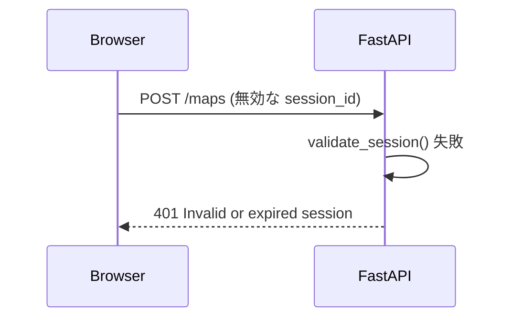

# シーケンス図

最終更新: 2026-06-06

## 主シナリオ：フロアマップ登録 → ジョブ実行 → 完了

```mermaid
sequenceDiagram
    participant B as Browser
    participant A as FastAPI
    participant D as SQLite

    B->>A: GET /
    A->>D: INSERT sessions
    A-->>B: Set-Cookie: session_id<br/>{session_id, expires_at}

    B->>A: POST /maps {map_name, grid_data}
    A->>A: 特殊地形検証 (F-03)<br/>ハニーポット検証 (F-12)
    A->>D: INSERT maps
    A->>D: INSERT map_cells
    A-->>B: {map_id}

    B->>A: POST /robots {model_type, capabilities}
    A->>A: ケイパビリティ検証
    A->>D: INSERT robots
    A->>D: INSERT robot_capabilities
    A-->>B: {robot_id}

    B->>A: POST /jobs {robot_id, map_id, job_type}
    A->>D: SELECT maps, robots
    A->>A: 地形×capability マトリクス確認
    A->>D: INSERT jobs (PENDING)
    A-->>B: {job_id}

    B->>A: POST /jobs/{job_id}/start
    A->>A: BFS 経路計算 (F-06)
    A->>D: UPDATE jobs → IN_PROGRESS
    A->>D: UPDATE robots → RUNNING
    A-->>B: {job_id, started_at}

    loop ポーリング（1秒ごと）
        B->>A: GET /robots/{robot_id}/position
        A->>D: SELECT robot_positions
        A-->>B: {x, y, cell_type, updated_at}
    end

    Note over A,D: シミュレーション完了
    A->>D: UPDATE jobs → COMPLETED
    A->>D: UPDATE robots → IDLE

    B->>A: GET /jobs/history
    A->>D: SELECT jobs
    A-->>B: {history[], coverage_pct}
```

## キャンセルシナリオ

```mermaid
sequenceDiagram
    participant B as Browser
    participant A as FastAPI
    participant D as SQLite

    B->>A: POST /jobs/{job_id}/cancel
    A->>D: SELECT jobs (status 確認)
    A->>A: cancel_simulation() タスクキャンセル
    A->>D: UPDATE jobs → CANCELLED
    A->>D: UPDATE robots → IDLE
    A-->>B: {cancelled: true, cleaned_cells}
```

## セッション無効シナリオ

```mermaid
sequenceDiagram
    participant B as Browser
    participant A as FastAPI

    B->>A: POST /maps (無効な session_id)
    A->>A: validate_session() 失敗
    A-->>B: 401 Invalid or expired session
```
