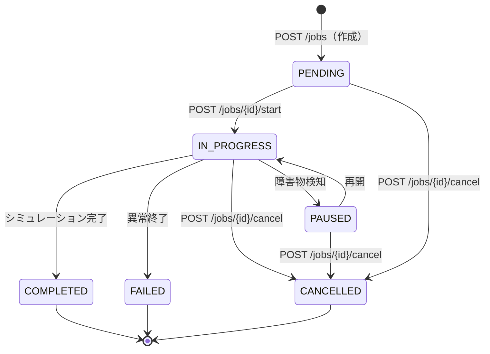
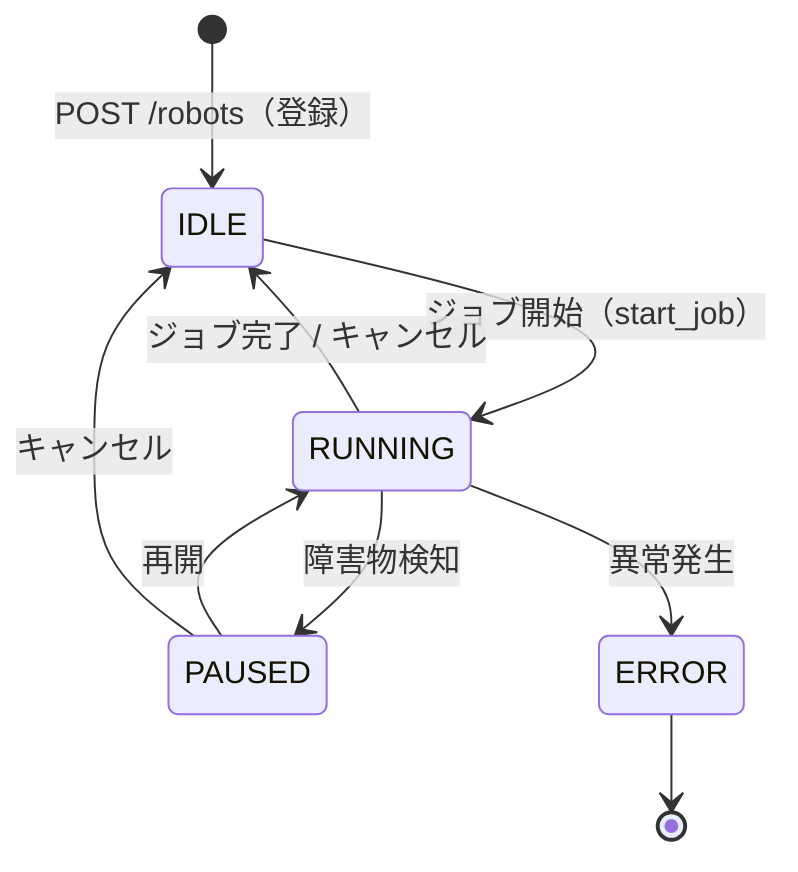
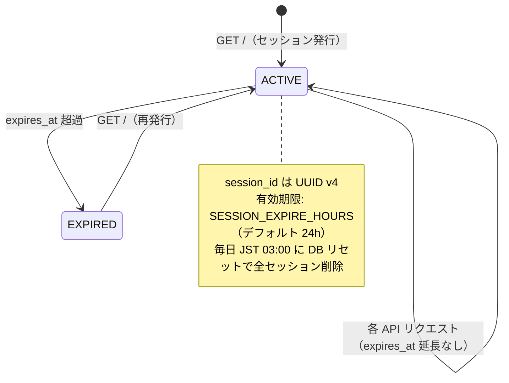

# 状態遷移図

最終更新: 2026-06-06

## ジョブの状態遷移

```mermaid
stateDiagram-v2
    [*] --> PENDING : POST /jobs（作成）

    PENDING --> IN_PROGRESS : POST /jobs/{id}/start
    PENDING --> CANCELLED : POST /jobs/{id}/cancel

    IN_PROGRESS --> COMPLETED : シミュレーション完了
    IN_PROGRESS --> FAILED : 異常終了
    IN_PROGRESS --> CANCELLED : POST /jobs/{id}/cancel
    IN_PROGRESS --> PAUSED : 障害物検知

    PAUSED --> IN_PROGRESS : 再開
    PAUSED --> CANCELLED : POST /jobs/{id}/cancel

    COMPLETED --> [*]
    FAILED --> [*]
    CANCELLED --> [*]
```

## ロボットの状態遷移

```mermaid
stateDiagram-v2
    [*] --> IDLE : POST /robots（登録）

    IDLE --> RUNNING : ジョブ開始（start_job）

    RUNNING --> IDLE : ジョブ完了 / キャンセル
    RUNNING --> PAUSED : 障害物検知
    RUNNING --> ERROR : 異常発生

    PAUSED --> RUNNING : 再開
    PAUSED --> IDLE : キャンセル

    ERROR --> [*]
```

## セッションの状態遷移

```mermaid
stateDiagram-v2
    [*] --> ACTIVE : GET /（セッション発行）

    ACTIVE --> ACTIVE : 各 API リクエスト（expires_at 延長なし）
    ACTIVE --> EXPIRED : expires_at 超過

    EXPIRED --> ACTIVE : GET /（再発行）

    note right of ACTIVE
        session_id は UUID v4
        有効期限: SESSION_EXPIRE_HOURS（デフォルト 24h）
        毎日 JST 03:00 に DB リセットで全セッション削除
    end note
```
