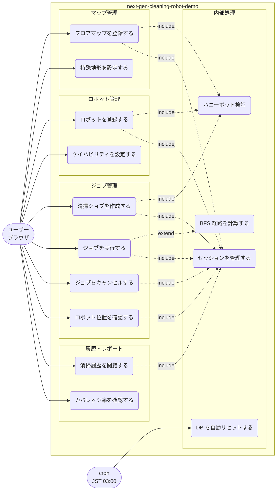

# ユースケース図

最終更新: 2026-06-06

## アクター説明

| アクター | 説明 |
|---------|------|
| ユーザー（ブラウザ） | セッション ID で識別されるデモ利用者 |
| cron（JST 03:00） | 毎日 03:00 に DB 全データをリセットする自動処理 |

## ユースケース一覧

| ID | ユースケース | 対応 API |
|----|------------|---------|
| UC1 | フロアマップを登録する | POST /maps |
| UC2 | 特殊地形を設定する | POST /maps（grid_data 内 STAIR/NARROW_GAP） |
| UC3 | ロボットを登録する | POST /robots |
| UC4 | ケイパビリティを設定する | POST /robots（capabilities[]） |
| UC5 | 清掃ジョブを作成する | POST /jobs |
| UC6 | ジョブを実行する | POST /jobs/{id}/start |
| UC7 | ジョブをキャンセルする | POST /jobs/{id}/cancel |
| UC8 | ロボット位置を確認する | GET /robots/{id}/position |
| UC9 | 清掃履歴を閲覧する | GET /jobs/history |
| UC10 | カバレッジ率を確認する | GET /jobs/history（coverage_pct） |
| UC11 | セッションを管理する | GET /（Cookie 発行） |
| UC12 | ハニーポット検証 | 全フォーム POST（website フィールド） |
| UC13 | BFS 経路を計算する | 内部処理（start 時） |
| UC14 | DB を自動リセットする | 内部処理（cron） |
